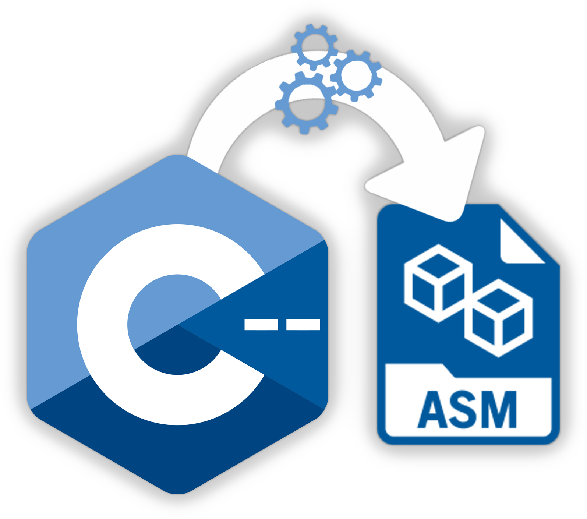

# C-Compiler

<p align="center">

</p>
<br><br>

[](https://www.python.org/downloads/)
[](https://www.antlr.org/)
[](https://en.wikipedia.org/wiki/MIPS_architecture)

This is a compiler project for a subset of C, implemented in Python. The compiler takes C code as input and generates
MIPS assembly code as output. It also includes a script to automatically build and run the assembly code using MARS MIPS
simulator.

## Features

- Parses C code using the ANTLR4 grammar.
- Compiles C code to MIPS assembly.
- Provides an option to visualize the abstract syntax tree (AST) as a PDF.
- Fully tested for syntax and semantic errors.
- Supports Python 3.10 or higher.

## Usage

To use the compiler, run the following command:

```shell
python3 main.py [path-to-C-file] [options]
```

The available options are:

- -v or --visualize: Visualize the abstract syntax tree as a PDF.
- -r or --run: Run the generated MIPS assembly code using MARS.
- -h or --help: Show the help menu

To run the tests, run the following command:
```shell
pytest
```

## Prerequisites

Make sure you have the following dependencies installed:

- Python >= 3.10
- Java
- ANTLR4 (included in the repository)
- MARS MIPS simulator (included in the repository)

## Getting Started

Clone this repository:

```shell
git clone https://github.com/AchrafYndz/C-Compiler.git
```

Install the required dependencies:

```shell
pip install -r requirements.txt
```

Compile the ANLTR grammar by running the `scripts/run_antlr.sh` script.

Run the compiler with your C code:

```shell
python3 main.py path/to/your/C/file.c [options]
```

## Contributing

This project was developed as a group project by AchrafYndz and 9MaxR9. Contributions are welcome! If you find any
issues or want to add new features, please open an issue or submit a pull request.

## License

This project is licensed under the MIT License.
